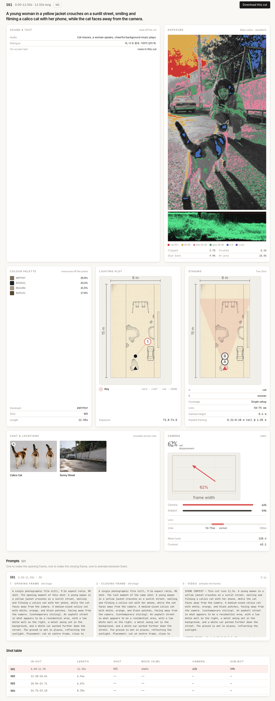
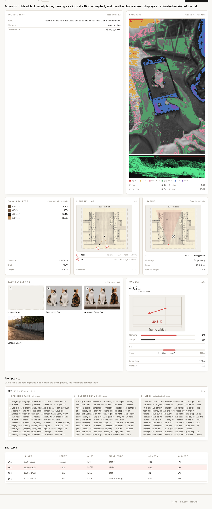
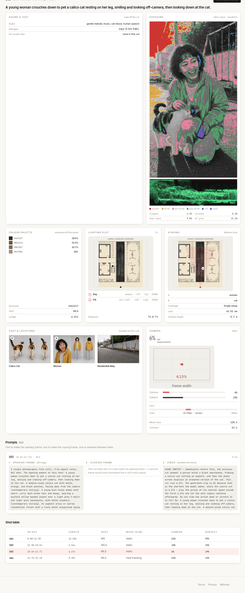
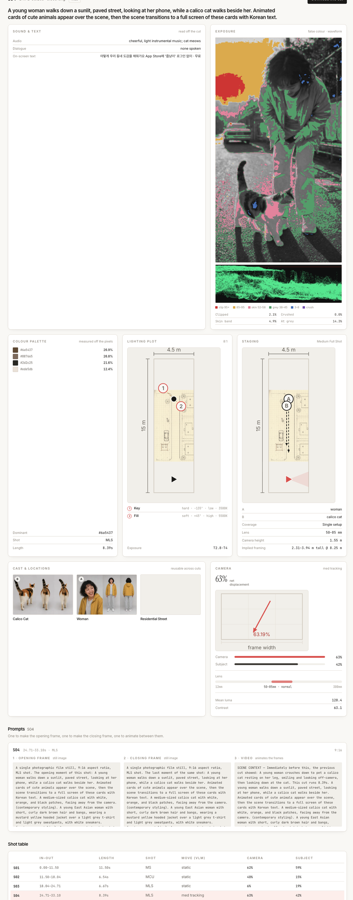

# Cutaway teardown of the finished cat spot (4 cuts, unlocked 2026-09-07)

The rendered 33 s spot was fed back into [Cutaway](https://cutawayfilm.com) — the author's own cut-by-cut film-analysis tool — to check whether the moveboard survived the render. It did: the machine cut boundaries land on the moveboard's 12 s / 18 s cuts, and it read all three dialogue lines off the audio.

| cut | in–out | length | shot | move | camera disp. | subject disp. | dialogue it heard |
|---|---|---|---|---|---|---|---|
| S01 | 0.00–11.50 | 11.50 s | MS | static | 62% | 59% | "어, 너 또 왔네. 가만히 있어 봐." |
| S02 | 11.50–18.04 | 6.54 s | MCU | static | 40% | 15% | — (on-screen text: the phone's camera UI labels) |
| S03 | 18.04–24.71 | 6.67 s | MLS | static | 6% | 19% | "오늘도 한 마리 주웠다." |
| S04 | 24.71–33.10 | 8.39 s | MLS | med tracking | 63% | 42% | — (end card text) |

What each unlocked board contains: a one-line scene read, sound & text, false-colour exposure with waveform, a k-means palette, a lighting plot (key/fill/back with angle, height and colour temperature), a staging plan with lens and camera height, reusable cast/location sheets, and three prompts (opening frame / closing frame / video) to rebuild the cut.

Two things worth noticing in the boards:

- **S02 confirms the phone-UI defect**: Cutaway reads "사진, 동영상, 더보기" as on-screen text — the tiny camera-app labels the render model draws no matter what the prompt says (see the main README's limits).
- **S04 is the only tracking shot** (the camera walking backward as she stands up), and the lighting plot flips to an 8:1 hard key from behind — the backlit reveal the moveboard asked for.

| | |
|---|---|
|  |  |
|  |  |
